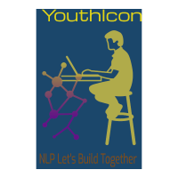

# YouthIcon

- Our goal is to put **India** on NLP map. We have to build NMT(Neural Machine Translations) models for low resourced Indian Languages. We will also build a living collection of NLP projects for Indians, by Indians. We are modelling this after [Masakhane](https://masakhane.io/).

**YouthIcon** as the name suggest will be a research effort for NLP for Indian languages that is LOW RESOURCED, OPEN SOURCE, CONTRY-WIDE, DISTRIBUTED and ONLINE. The **YouthIcon** will contain the data, code, results and research for building open baseline NLP results for Indian languages. **YouthIcon-MT** will contain the Machine Transaltion model. As Machine Translation (MT), an application area of Natural Language Processing (NLP) and a subfield of computational linguistics, facilitates automated translation of text or speech in a source natural language to corresponding text or speech in a different target natural language. Language incomprehensibility has wide-ranging adverse impacts on several aspects of human living, and the same can be reasonably alleviated with effective use of MT. Besides, the crucial idea of MT is to bridge communication barriers among people from different linguistic backgrounds. **YouthIcon** project will run under osDFS. 

This will be a healthy start to building Automated machine translation for English to other Indian languages. This will be built mainly to help increase quality of Indian languages wikipedia articles by translating for English Wikipedia. The approach will be to start building a parallel corpus between English and other Indian languages which can later be used in SMT(Statistical Machine Translation) or NMT (Neural Machine Translation) in future by interested people.

## Goals

- For Indian Languages first we will follow these things:

1. Our Source language will be English and the target language language will be Assamese, Bengali, Bodo, Dogri, Gujarati, Hindi, Kannada, Kashmiri, Konkani, Maithili, Malayalam, Manipuri, Marathi, Nepali, Oriya, Punjabi, Sanskrit, Santhali, Sindhi, Tamil, Telugu and Urdu. These are the 22 official languages of India. So, our target will be to create model for these 22 languages.

2. When we will have a model for these 22 languages, then we will follow vice-versa ie. `hi-en`.

- **For India**: We are looking for NLP enthusiast to build and facilitate a community of NLP researchers, connect and grow it, spurring and sharing further research, build helpful tools for applications in government, medicine, science and education, to enable language preservation and increase its global visibility and relevance. We want to build model for different Asian Languages. 

- **For NLP Research**: To build data sets and tools to facilitate NLP research on Asian languages, and to pose new research problems to enrich the NLP research landscape.

- **For the global researchers community**: To discover best practices for distributed research, to be applied by other emerging research communities.

## How can you contribute?

There are many ways to contribute to **YouthIcon**. We are looking for peoples who can join us for the following tasks:

1. **TRAIN A MODEL** - You can contribute a trained model and related code for your language ie. for India languages Assamese, Bengali, Bodo, Dogri, Gujarati, Hindi, Kannada, Kashmiri, Konkani, Maithili, Malayalam, Manipuri, Marathi, Nepali, Oriya, Punjabi, Sanskrit, Santhali, Sindhi, Tamil, Telugu and Urdu.
2. **ANALYSIS** - You can contribute on analysis of data/models for any languages. You do not need any technical experience for this! If you're a linguist, we can pair you up with a machine translation practitioner and you can help contribute analysis
3. **DATA** - You can help to build or find datasets for your language
4. **DOCUMENTATION** - We are looking for people to help on documenting our discussions, progress. This is VERY much needed. Or contribute to documentation of the base "notebook" that will improve the experience of others.
5. **MENTORSHIP** - We are also looking for mentors to provide advice or help tune models for their languages and datasets, or help people get started
6. **ADMIN** - We will work with so many researchers. So, it can be a quite challenge! You can help out us with administrative tasks
7. **COMPUTE** - You can help us with infrastructure and compute! Do you have spare compute to donate? Let us know! We're always looking for more.
9. **STORY-TELLING** - You can tell our stories to your fellow classmates, workers or the world by doing talks about the community, or engaging with media outlets
10. **MLOps & ML Engineering** - Do really you enjoy delving into the MLOps side of machine learning? Are you a software developer looking to hone-in on your ML engineer abilities? You can join us to help build tools to support out reproducability, data gathering, and model sharing!

## How can you join?

1. You can Join our [Slack](https://join.slack.com/t/youthiconworkspace/shared_invite/zt-e102vcid-l9LyldQJ303mePF9rxGWDQ)
2. Also we would like to feature you on our webpage [osDFS](https://www.osdfs.in) when you will successfully build a MT model. Please email the following to codegirls.opensource@gmail.com to give a ssubject name "YouthIcon MT model":
    - Your Full Name
    - A preferred social media link
    - You GitHub profile
    - The language(s) you'll be working on (or your general relevant specialty - if you're an expert at machine translation and - would like to boost the community through that)
    - A picture
    - Your affiliation and role.

# Code of Conduct

See [Code of Conduct](https://github.com/osDFS/Code-of-Conduct/blob/master/code-of-conduct.md)

## Acknowledgements
Some initial directory setup and scripts have been copied from [Masakhane](https://masakhane.io/). 