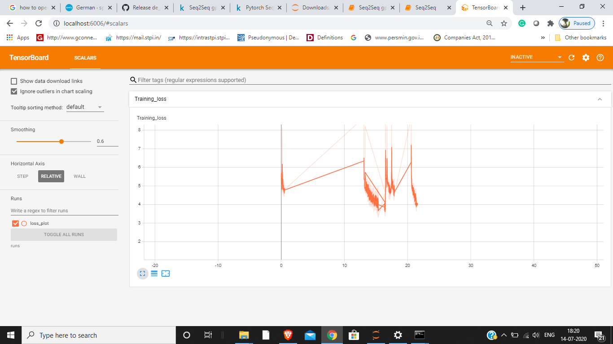
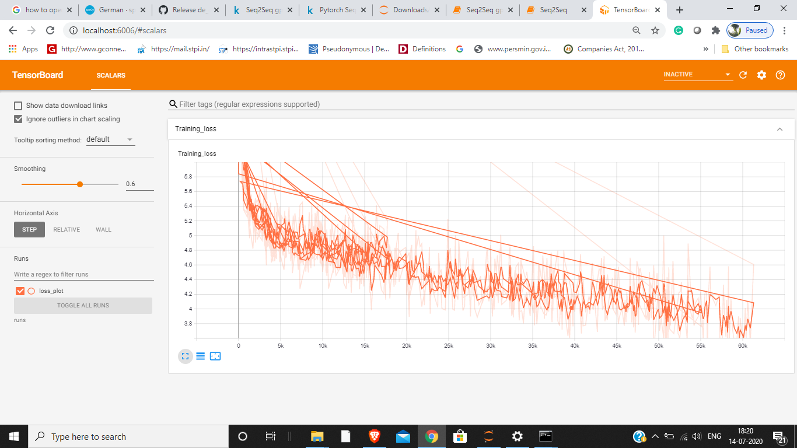

## Seq 2 Seq using Pytorch.

      

  
 
 
 

### Notebook 
In
[Seq2Seq_implemetation.ipynb](./Seq2Seq/Seq2Seq_implemetation.ipynb)  
, we will learn about this with an example of making a german to english language translator.

### Libraries needed : 
* Torch : Click to download [here](https://pytorch.org/get-started/locally/). Choose accordingly according to your system, but latest version.  

* Torchtext :  
      How to install: Run `pip install torchtext` in Command prompt.
      
* Numpy :  
    How to install : Run `pip install numpy` in Command prompt.

* Spacy :  
    Installation details according to your system click [here](https://spacy.io/usage). or else Run `pip install -U spacy`

### Dataset:  

We will be using german language and english language dataset, for installaton of which all details are provided in the notebook itself, read comments carefully.
Also, we will be using Multi30K dataset from torchtext.dataset. [Multi30K Files](./Seq2Seq/.data/multi30k).

### Trained Model:  

Trained model will be saved in the same directory ehere you will clone this repo , under Tutorials/Seq2Seq/ with name `my_checkpoint.pth.tar` . this notebook's trained model
can be seen at: [my_checkpoint.pth.tar](https://www.kaggle.com/simarpreetsingh019/pytorch-seq2seq-machine-translation/output?select=my_checkpoint.pth.tar).  

If you dont have gpu enabled pc, don't worry, _heres a hack_** :  use [*Kaggle Notebooks*](https://www.kaggle.com/kernels) to run your notebook, as it provides gpu also for 
running notebooks with 30 hours runtime per week. this will help you in getting results faster, and its free also.

### Bleu_score:  

BLEU, or the Bilingual Evaluation Understudy, is a score for comparing a candidate translation of text to one or more reference translations. Although developed for translation,
it can be used to evaluate text generated for a suite of natural language processing tasks. More the score, more will be its accuracy to correct translation.  

For this notebook, the **Bleu score =  21.06** .

### Loss plot  
We have used `torch.utils.tensorboard`, for using tensorboard to visualise a nice loss plot.
it can be installed by running `pip install --upgrade torch  
pip install tensorboard` in command prompt. It is supported with pytorch 1.2+, and tensorboard 1.14+.
For any issue related to its installation or import error, see [here](https://www.endtoend.ai/blog/pytorch-tensorboard/) or pytorch's [documentation](https://pytorch.org/docs/stable/tensorboard.html) 

After the model is saved, we can see the loss plot, saved in the folder name /runs/loss_plot in the same directory. 
to see the plot, open cmd in the folder/directory where Seq2Seq folder is saved or re direct it to /Youthicon folder, then Tutorials, Seq2Seq .
or just type cmd in the search bar after opening Seq2Seq folder,  
**then type** `tensorboard --logdir runs`. This will make a local server with port 6006, which is for tensorflow .  
--logdir runs is used because it will directly check for runs dolder. if you saved it with some other folder name, use that name intead of runs, to see it. when the server
will be hosted, you will get a link http://localhost:6006/ in cmd. copy this url, and paste it in browser . this will open the tensorboard UI, and you can see your plot.
Like this:  

**Loss Plots:**
      
 

       
 
 
     
 
